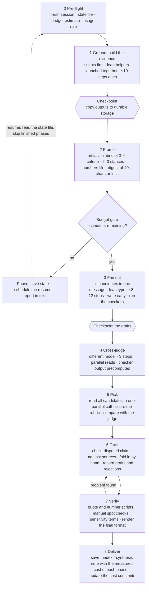

# ArenaSupreme

Fan out a few parallel attempts at the same task, read them all, pick the strongest as the base, graft the best of the others into it, and verify the result.

ArenaSupreme rebuilds the arena pattern around a measured run (Cowork, October 2026). In that run:
- a third of the spend produced nothing, because helpers that saved only at the end hit the usage limit and others were relaunched blind;
- about 30% of the spend went on helper start-up overhead.

Every number below comes from that run. Paths are relative to this skill folder.

| Goal | Tool | Reference |
|---|---|---|
| Run an arena end to end | The map and phases 0–8 below | `references/TEMPLATES.md` |
| Make a cheap helper type | Lean agent definition | `references/TEMPLATES.md` §1 |
| Share evidence once | `scripts/build_digest.py` | Rule 6 |
| Check quotations and figures | `scripts/verify_quotes.py`, `scripts/check_numbers.py` | Phase 7 |
| Aggregate blind pairwise judges | `scripts/bt_aggregate.py` | Phase 1 |
| Measure what a phase cost | `scripts/usage_meter.py` | Rule 10 |

## The map

Track one checklist item per phase (0–8) before launching anything. Keep `ARENA_STATE.json` in the working folder and update it whenever a phase ends.

## The cost model

All costs are cost-weighted tokens: a cache read counts 0.1×, a cache write 2×, output 5× and plain input 1×.

| Item | Measured |
|---|---|
| Entry cost of a helper with **all tools** (general-purpose type) | 58–80k of context. About 130–160k cost when launched alone, 40–60k each when launched together (they share the cache) |
| Entry cost of a **file-tools-only** helper (a custom lean type) | **17k of context**, about 4–5× cheaper than the all-tools type |
| Each step a helper takes | About 0.1 × its current context |
| New material read | About 2 × its size, once |
| Helper cache lifetime | **5 minutes.** A long think or write step lets it expire, and then the whole context is re-cached at 2× |
| Whole-novel cold read (82k words), chapter by chapter, 26–34 steps | 1.1–1.5M |
| Report writer, reading everything | 1.0–3.0M, often with nothing saved |
| Report writer on a shared digest, 12 steps | 0.9M, with a verified draft saved |
| Cross-judge (sonnet), 3 steps | 0.37M |
| Orchestrator steps once its context passes about 250k | 20–30k **per step** |

**How to estimate.** Helper cost ≈ entry + Σ(0.1 × context at each step) + 2 × new material + 5 × output. Then add 50%, because every estimate in the source run came in low.

## Rules

1. **Scripts before helpers.** Do mechanical work with scripts, which cost no model tokens:
   - converting, splitting and metrics;
   - decoding labels and aggregating judgements (`scripts/bt_aggregate.py`);
   - building digests (`scripts/build_digest.py`);
   - checking quotes and figures (`scripts/verify_quotes.py`, `scripts/check_numbers.py`).
   Use helpers only for judgement.
2. **Use a lean helper type.** If the host supports custom agent definitions (for example `.claude/agents/<name>.md`), create a worker with only file tools: Read, Write, Edit, Bash, Grep, Glob. The template is in `references/TEMPLATES.md`. A new definition becomes available from the **next** session, so create it a session ahead. Use the all-tools type only when a helper needs connectors or the web.
3. **Use the fewest helpers, all launched together.** Launch every helper of a phase in one message, so they share the instruction cache. Never spawn a helper for a one-line job; do it inline or batch it.
4. **Take few, large steps.** Briefs set a step budget: 10 steps or fewer for a whole-text read, 8–12 for a writer, 3 for a judge. Helpers should:
   - read whole files, or one batched `cat`, per call;
   - issue independent reads in parallel within one step;
   - keep no running notes file;
   - write the deliverable once, then make at most one revision pass.
5. **Stay inside the 5-minute cache.** Keep a helper's context small before its long write. Ask long writers to write in 2–3 sections, each a quick step.
6. **Read once and share.** Build one verbatim, script-made digest of the shared evidence, and keep each file to **40k characters or less** so it shows in one call. Above that, the helper pages through it and pays for 2–3 extra steps. Candidates read the digest, not every source file. Long sources are only for batched `grep` spot checks.
7. **Precompute the facts.** Put every figure the writers may cite in a script-verified `NUMBERS.md`. Writers may only use those figures, or recomputations they show.
8. **Checkpoint everything.**
   - Helpers write a complete draft early and improve it in place.
   - After each phase, copy its outputs to durable storage (the user's folder, not only the sandbox) and update the state file.
   - Before any relaunch, read the state file and check the output folders. **Never redo work that is already on disk.**
9. **Resume, don't relaunch.** If a helper stops on a limit, message it to resume: its context is intact. A fresh launch pays again for everything it had read.
10. **Gate the budget for each phase.**
    - Before a heavy phase, estimate its cost. After it, measure with `scripts/usage_meter.py --since <start>`.
    - Run heavy phases one at a time, not back to back in one burst.
    - Honour the user's usage-limit rule. For example, if it says pause at 10% left, save state and schedule the resume.
11. **Keep the orchestrator light.** Start heavy arenas in a fresh or compacted session, with the state file and digest on disk. Have helpers return short final messages (path plus a one-line result). Read candidate files yourself only in Phase 5, in one parallel call.
12. **Subagent file writes.** If the Write tool refuses a path inside a helper, write with a quoted Bash heredoc instead of retrying.

## Phase by phase

### 0. Pre-flight

- Confirm the session is fresh, or that its context is small.
- Create `ARENA_STATE.json` (template in references). Write down the task, the output location, the user's file rules (for example: never delete, numbering duplicates `_#`, the index) and any usage-limit rule.
- Estimate the total cost with the cost model, then tell the user the estimate and its range in one line.

### 1. Ground: build the evidence (when the task needs evidence)

- Run scripts first: conversions, blind copies, metrics.
- Judgement-heavy evidence goes to lean helpers, launched together, with fixed briefs. Proven designs for comparing versions:
  - **Blind whole-text readers.** Give them personas and one identical brief. Calibrate each reader on a baseline version, and judge by the change from that baseline, not by the absolute score.
  - **Blind matched-passage judges.** Use 6 passages and 2 judges per passage, with a different random label order for each judge. Ask for pairwise margins from 1 to 3. Aggregate with `bt_aggregate.py`.
- Keep the label keys out of the helpers' folders.
- Checkpoint the evidence to durable storage before going on.

### 2. Frame

1. State the artifact.
2. Write a rubric of **3–6 concrete criteria the picker can grade**. Concrete: "every quotation is verbatim in its cited source". Vague: "good report". Candidates never see the rubric.
3. Choose the panel: **2–3 candidates with different stances** (for example planner, reviewer, designer), on the lean type. Candidates should differ in structure, not in what they read.
4. Give each candidate its own output path: `/tmp/arena-<slug>/candidate-<n>/`.
5. Build `NUMBERS.md` and the digest by script.
6. Write one candidate brief (template in references): the task, the exact files to read, the step budget, the rules, the checkers to run and the deliverables (artifact + a rationale of 400 words or less naming the alternatives rejected).
7. Run the budget gate.

### 3. Fan out

- Launch all candidates in **one message**. Each produces the artifact plus its rationale.
- When they finish: run the checkers on each draft, then copy every draft to durable storage.
- If a candidate fails, check its folder first and resume it if possible. Proceed with N−1 and note the dropout.

### 4. Cross-judge

- Use one read-only judge on a **different model** from the candidates (for example sonnet when the candidates run on opus).
- Give it the rubric, the candidates by path, and the **checker output precomputed**.
- Tell it to read every file in one parallel step and write once. It scores each criterion from 1 to 10, gives the strengths and weaknesses of each candidate, recommends a base, names the best one to three grafts from each loser, lists any errors, and says whether the candidates converge.
- Launch it only after all candidates are on disk.

### 5. Pick

- Read every candidate end to end, in one parallel read call.
- Score the rubric criterion by criterion, then compare with the judge.
  - If you agree, that confirms the pick.
  - If you disagree, read both rationales before deciding.
- Pick the base a future maintainer can extend most easily.
- Record the pick, both score tables and the reason in `SYNTHESIS_NOTE.md`.

### 6. Graft

- For each loser, take one to three items, usually the ones the judge named.
- Before taking any claim the candidates or the judge disputed, **check it against the sources** with batched `grep`. Drop anything you cannot verify.
- Fold each graft in by hand so the result reads as one piece.
- Record:
  - every graft, with its source;
  - every rejection, with the reason (this is the highest-signal part of the note);
  - any facts removed as unverifiable.
- If the candidates converge, ship the consensus. If they wildly diverge, the frame was too loose: reframe and re-run rather than averaging.

### 7. Verify

- Run `verify_quotes.py` (every quotation must be verbatim) and `check_numbers.py` (every figure not in the reference files must be a recomputation shown in the text, a section reference or a target).
- Spot-check every new claim taken from a graft, scan for any terms the user has banned, and check the length.
- Render the final format (for example docx → pdf → page images) and look at it. Fix layout faults such as lists that need a blank line before them.
- If verification finds a problem, go back to Graft. Don't paper over it.

### 8. Deliver

- Save the artifact and the supporting files to the user's chosen location, following their naming and index rules.
- Finish `SYNTHESIS_NOTE.md`: the base, the grafts, the rejections, any dropouts, the verification result and **the measured cost of each phase against its estimate**.
- Update the cost constants in your runbook if the measurements moved them.
- Report in one or two sentences, with an index of the saved files. Be honest about any cost overrun and why it happened.

## Anti-patterns seen in the source run

- **Helpers that save only at the end.** The usage limit wiped out their work.
- **Relaunching after a stop without checking the folders.** That burned 2.2M for nothing.
- **Fifteen all-tools helpers for jobs that needed one file read each.** The entry cost dominated.
- **Reading a novel one chapter per step, with a notes edit after each part.** That meant about 30 steps of ever-growing re-reads.
- **Letting writers read the whole manuscript "to check quotes".** Their context grew to 300–430k.
- **A digest too large to show in one call.** It forced paged reads.
- **Orchestrating from a session with a very large context.** The orchestrator became the biggest single cost.
